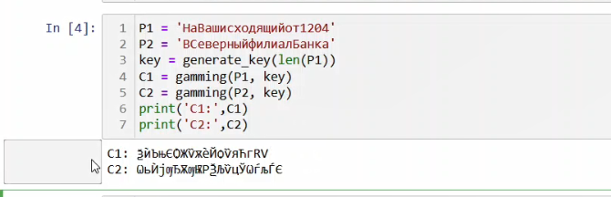
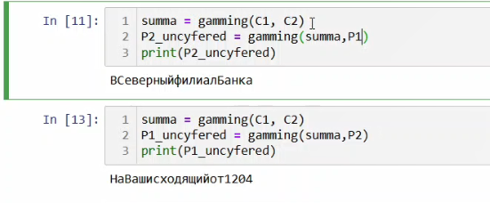

---
# Front matter
lang: ru-RU
title: "Лабораторная работа № 8"
subtitle: "Элементы криптографии. Шифрование (кодирование) различных исходных текстов одним ключом"
author: "Аксёнова Алина Владимировна"

# Formatting
toc-title: "Содержание"
toc: true
toc_depth: 2
lof: true
lot: true
fontsize: 12pt
linestretch: 1.5
papersize: a4paper
documentclass: scrreprt
polyglossia-lang: russian
polyglossia-otherlangs: english
mainfont: PT Serif
romanfont: PT Serif
sansfont: PT Sans
monofont: PT Mono
mainfontoptions: Ligatures=TeX
romanfontoptions: Ligatures=TeX
sansfontoptions: Ligatures=TeX,Scale=MatchLowercase
monofontoptions: Scale=MatchLowercase
indent: true
pdf-engine: lualatex
header-includes:
  - \linepenalty=10
  - \interlinepenalty=0
  - \hyphenpenalty=50
  - \exhyphenpenalty=50
  - \binoppenalty=700
  - \relpenalty=500
  - \clubpenalty=150
  - \widowpenalty=150
  - \displaywidowpenalty=50
  - \brokenpenalty=100
  - \predisplaypenalty=10000
  - \postdisplaypenalty=0
  - \floatingpenalty = 20000
  - \raggedbottom
  - \usepackage{float}
  - \floatplacement{figure}{H}
---

# Цель работы

Освоить на практике применение режима однократного гаммирования на примере кодирования различных исходных текстов одним ключом

# Задание

Прочитать оба текста, не зная ключа и не стремясь его определить

# Теоретическое введение

С точки зрения теории криптоанализа, метод шифрования однократной случайной равновероятной гаммой той же длины, что и открытый текст, является невскрываемым (далее для краткости авторы будут употреблять термин "однократное гаммирование", держа в уме все вышесказанное). Обоснование, которое привел Шеннон, основываясь на введенном им же понятии информации, не дает возможности усомниться в этом - из-за равных априорных вероятностей криптоаналитик не может сказать о дешифровке, верна она или нет. Кроме того, даже раскрыв часть сообщения, дешифровщик не сможет хоть сколько нибудь поправить положение - информация о вскрытом участке гаммы не дает информации об остальных ее частях.

# Ход работы

1. Импортируем все необходимые библиотеки и пишем функцию генерирования ключа, а также функцию гаммирования. (Рис. [-@fig:001]).

{ #fig:001 width=73% }

2.  Генерируем случайный ключ, а затем определяем вид шифротекстов С1 и С2 при известном ключе и известном открытом тексте. (Рис. [-@fig:002]).

{ #fig:002 width=73% }

3. Применяем функцию "gamming" к полученным шифрам, а затем еще и к одному из открытых текстов, чтобы получить другой, неизвестный открырй текст (Рис. [-@fig:003]).

{ #fig:003 width=73% }

# Ответы на котнрольные вопросы

1. Необходимо прогаммировать один шифротекст вторым, а после прогаммировать результат одним из исходных текстов. Таким образом мы получим другой исходный текст.

2. Мы из шифрованного текста обратно получим исходный нешифрованный..

3. Поочередно гаммируем каждый текст одним ключом.

4. Подверженность взлому, шифр становится абсолютно вскрываемым. При утечке же хотя бы части одного из исходных текстов злоумышленник сможет расшифровать все тексты.

5. Можно сократить издержки по доставке ключей сторонам, либо вообще исключить их, если ключ использовать все время.

# Выводы

В результате выполнения данной работы было освоено на практике применение режима однократного гаммирования на примере кодирования различных исходных текстов одним ключом

# Библиографический список  

1. Острейковский В. А. Информатика: учеб. для вузов / В. А. Острейковский. - 4-е изд., стер. - М.: Высш. шк., 2007. - 511 с.

2.  Алексеев, М. Е. Шифрование методом гаммирования / М. Е. Алексеев // 70-я научно-техническая конференция учащихся, студентов и магистрантов, 15-20 апреля 2019 г., Минск : сборник научных работ : в 4 ч. Ч. 4. - Минск : БГТУ, 2019. - С. 398-401.

3. Прикладные задачи шифрования [Электронный ресурс].  – Режим доступа : http://citforum.ru/internet/securities/cryptobook07.shtml, свободный. – Загл. с экрана.

4. Шифры гаммирования [Электронный ресурс].  – Режим доступа : https://bstudy.net/825827/tehnika/shifry_gammirovaniya, свободный. – Загл. с экрана.